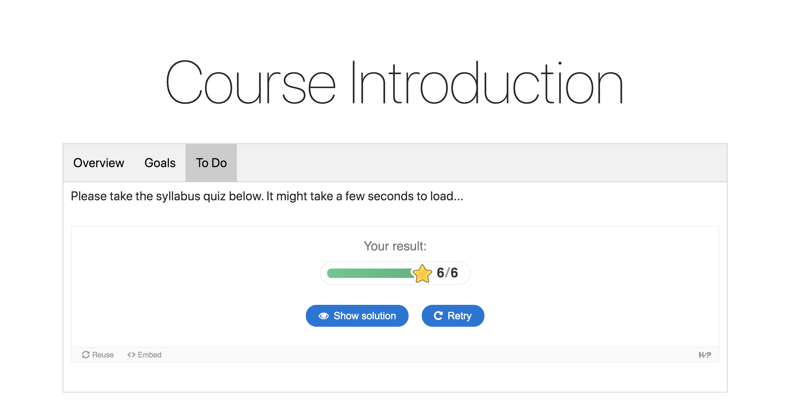

# Web-Technologies
# Daylin Scott
# Week 1 Homework
I was a little bit confused about what a server was and what a client was when we talked about it on Zoom as a class, but i think I am beginning to get more of a feel for it after reading the information provided on the website. From what I gather, the server is sort of what happens "behind the scenes", it houses the information from databases that can be retrieved on the client side by typing into a search bar (such as said on the Moodle website) and provides general structure for web pages. The client side seems to be more about the user experience and connecting the user and the server in a way that is intuitive and user friendly. In my head I think of it sort of like the server holds the tools for whatever purpose a given website is meant to serve and the client side makes those tools accessible to people in an easy to understand/intuitive way. Essentially, the client side means that the action takes place on the user's computer and the server side means that the action takes place on a web server.

If I am wrong on any of this or it needs clarification please let me know, I'm feeling a little bit like I might be getting in over my head by taking this class, but I really would like to learn and do my best.

